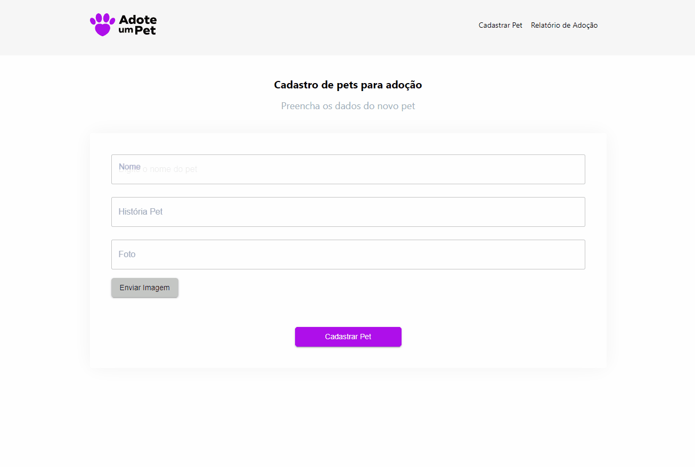
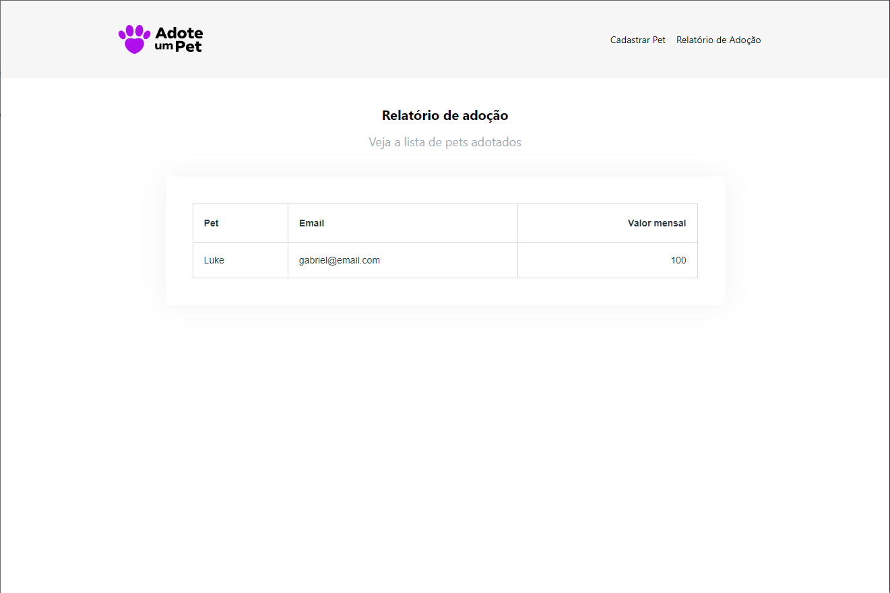

# Sobre o projeto
<p> Este é um projeto, fictício, realizado durante o workshop Treinaweb Multi Stack#3 que tem por objetivo o aprendizado de novas tecnologias, 
e conceitos de arquiteturas, para a criação de aplicações de médio porte.</p>

<p>A aplicações tem como objetivo ajudar ONGs e pessoas que gostam de animais, pois muitas das vezes estas instituições passam por dificuldades
financeiras devido a alta quantidade de animais e a falta de espaço. Em contrapartida existem muitos casos de pessoas que acabam  não adotando estes devido a falta de tempo e espaço para a criação, foi pensando nisto que surgiu o projeto Adote Um Pet que oferece a possibilidade de que pessoas façam o processo de  adoção de forma virtual destes pets, ajudando assim estas ONGs a arcarem com os custos mensais deles.</p>


# A aplicação consiste das seguintes funcionalidades

- Área para o cadastro de novos pets
<p></p>


- Lista de Pets onde também será possível fazer a adoção de algum Pets
<p></p>


- Relatório para controle interno de todas as adoções realizadas
<p></p>


## Pré-requisitos

Antes de comecar, voce vai precisar ter instalado em sua máquina as seguintes ferramentas: [Git](https://git-scm.com), [NodeJS](https://nodejs.org/en/), [PHP7](https://www.php.net/) e o [Composer](https://getcomposer.org/).
Além disto é bom ter um editor de texto para para trabalhar com o código fonte como [VSCode](https://code.visualstudio.com/).


# Tecnologias Usadas no projeto

Para a criação do frontend da aplicação foram usadas as seguintes tecnologias:
<p>[Typescript](https://www.typescriptlang.org/)</p>
<p>[ReactJS](https://pt-br.reactjs.org/)</p>
<p>[Next.js](https://nextjs.org/)</p>

E para a criação do backend (API) foram usadas as seguintes:
<p>[Laravel](https://laravel.com/)</p>
<p>[SQLite](https://www.sqlite.org/)</p>

# Configurações do projeto
- Na pasta 'adote-um-pet/backend' criar um arquivo .env seguindo o arquivo de exemplo '.env.example' e excluir as variáveis:

```bash
DB_HOST=127.0.0.1
DB_PORT=3306
DB_DATABASE=laravel
DB_USERNAME=root
DB_PASSWORD=
```
Pois são desnecessárias para o projeto.

- A seguir, alterae o valor do campo DB_CONNECTION para sqlite, como abaixo:

```bash
DB_CONNECTION=sqlite
```

 - Na pasta 'adote-um-pet/backend/database' crie um arquivo chamado 'database.sqlite' onde serão armazenados os dados da aplicação


# Como executar
```bash
#Baixar o repositório do projeto
git clone https://gabrielalves962008@bitbucket.org/gabrielalves962008/adote-um-pet.git

----------------INICIALIZANDO O BACKEND -------------
   
#acessando a pasta com o backend da aplicação 
cd adote-um-pet/backend
   
#baixando as dependências necessárias
composer install
   
#Criando a estrutura do banco de dados
php artisan migrate

#estartando o backend
php artisan serve
   
#Você deverá receber a seguinte saída em seu terminal: 
# - Starting Laravel development server: http://127.0.0.1:8000

----------------INICIALIZANDO O FRONTEND -------------    
#acessando a pasta com o frontend da aplicação 
cd adote-um-pet/frontend
   
#baixando as dependências necessárias
npm install 
   
#estartando o frontend
npm run dev
   
#Abra [http://localhost:3000](http://localhost:3000) com seu navegador para ver o resultado.
  
```